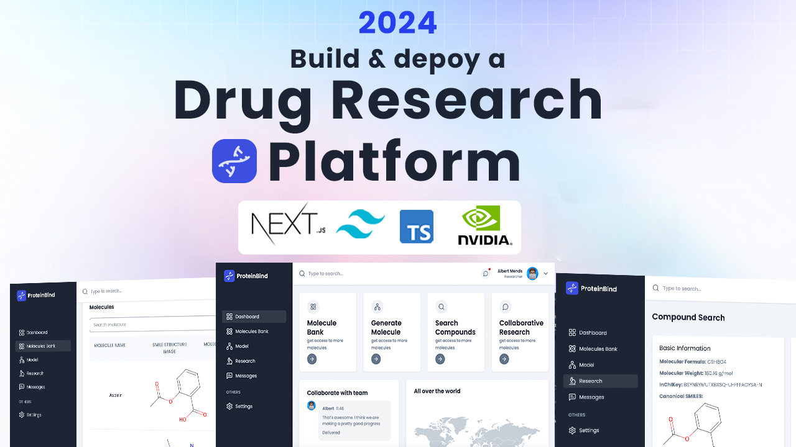

<div align="center">
  <br />
    <a href="https://ngit.ac.in/" target="_blank">
      
    </a>
  
  <br />

  <h3 align="center">Samyojan</h3>

</div>

## 📋 <a name="table">Table of Contents</a>

1. 🤖 [Introduction](#introduction)
2. ⚙️ [Tech Stack](#tech-stack)
3. 🔋 [Features](#features)
4. 🤸 [Quick Start](#quick-start)
5. 🧬 [Protein Data Processing](#protein-data)
6. 🚀 [More](#more)


## <a name="introduction">🤖 Introduction</a>

**Samyojan** is a drug discovery platform for designing experiments based on de-novo design methods using state of the art machine learning models and techniques including diffusion models, transformers and reinforcement learning as applicable to life sciences and specifically drug discovery & development. 

The platform is designed to help researchers accelerate drug discovery by leveraging cutting-edge AI models.


## <a name="tech-stack">⚙️ Tech Stack</a>

- **Next.js**
- **TypeScript**
- **Tailwind CSS**
- **React Chart.js** (for visualizing protein data)

## <a name="features">🔋 Features</a>

👉 **Protein Structure Prediction**: Predicts 2D protein structures using NVIDIA models.

👉 **Collaborative Research**: Researches can create groups and colloborate with other research online

👉 **Responsive Design**: Ensures seamless experience across all devices, from desktops to mobile.

## <a name="quick-start">🤸 Quick Start</a>

Follow these steps to set up the project locally on your machine.

### **Prerequisites**

Make sure you have the following installed on your machine:

- [Git](https://git-scm.com/)
- [Node.js](https://nodejs.org/en)
- [npm](https://www.npmjs.com/) (Node Package Manager)

### **Cloning the Repository**

```bash
git clone https://github.com/ajaybha/samyojan-ui.git
cd samyojan-ui
```

### **Installation**

Install the project dependencies using npm:

```bash
npm install
```

### **Set Up Environment Variables**

Create a new file named `.env` in the root of your project and add the following content:

```env
NEXT_PUBLIC_NVIDIA_API_KEY=your-nvidia-api-key

ABLY_API_KEY='your-ably-api-key'

MONGODB_URL='your-mongodb-url'

NEXT_PUBLIC_API_BASE_URL=http://localhost:3000

RESEND_KEY='your-resend-api-key'
```

### **Running the Project**

```bash
npm run dev
```

Open [http://localhost:3000](http://localhost:3000) in your browser to view the project.

## <a name="protein-data">🧬 Protein Data Processing</a>

This section covers the protein data processing pipeline, including loading protein structure files (e.g., PDB format), performing molecular docking simulations, and visualizing the results.

### **Protein Structure Input**

Users can upload PDB files for protein structures, which will then be processed by NVIDIA NeMo's protein-folding models.

### **Docking Simulation**

Using molecular docking algorithms, the system predicts how small molecules (such as drug candidates) bind to protein targets.

## <a name="more">🚀 More</a>

Stay tuned for more updates and features! Join our community, contribute to the repository, and follow along with our detailed tutorials.

## 📞 **Contact & Community**

If you have any questions or need support, feel free to join our Discord server or contact us through GitHub Discussions.

